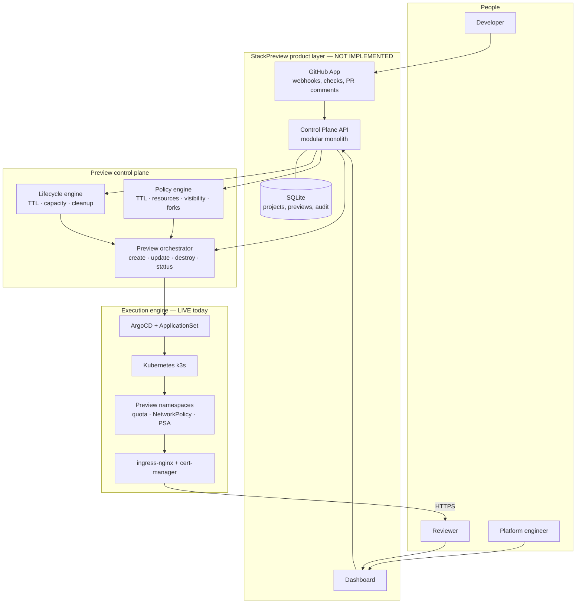
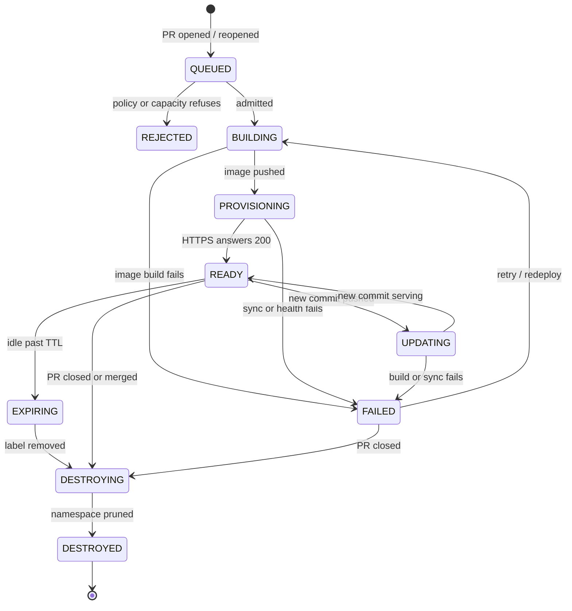
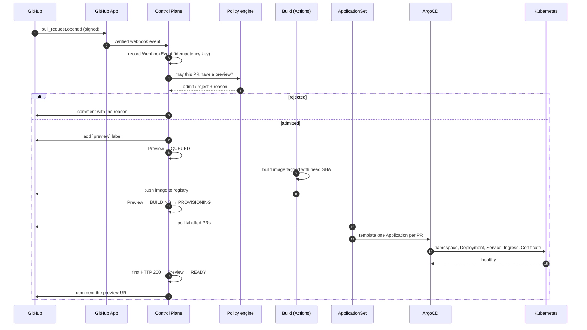
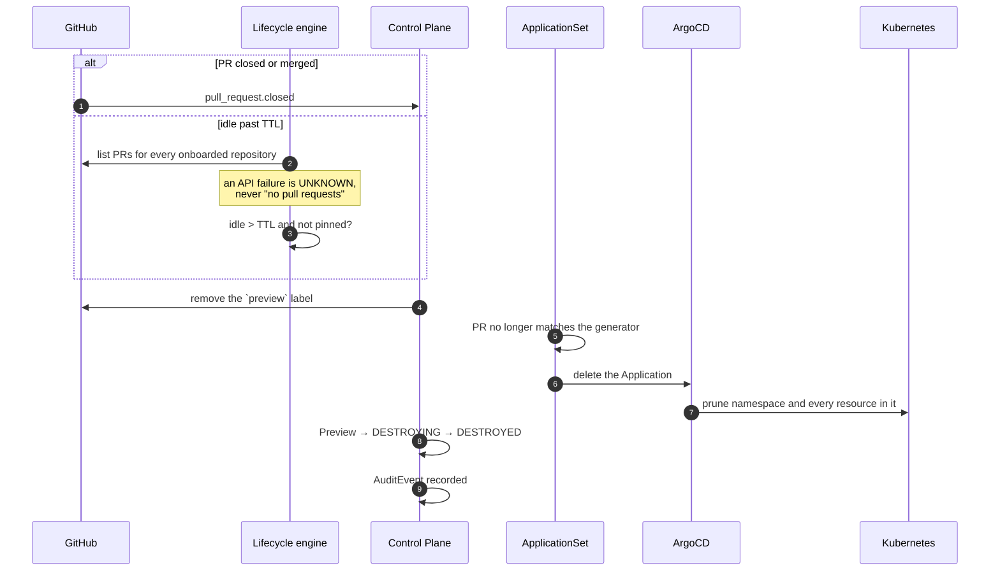
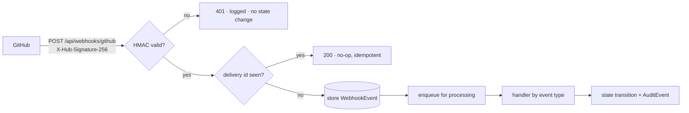
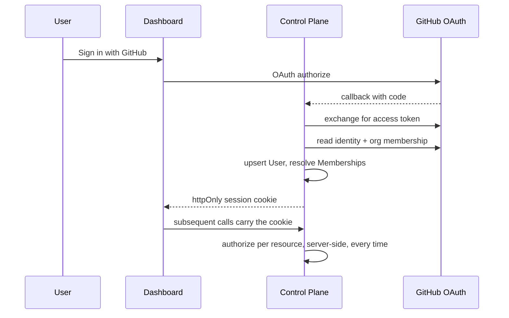
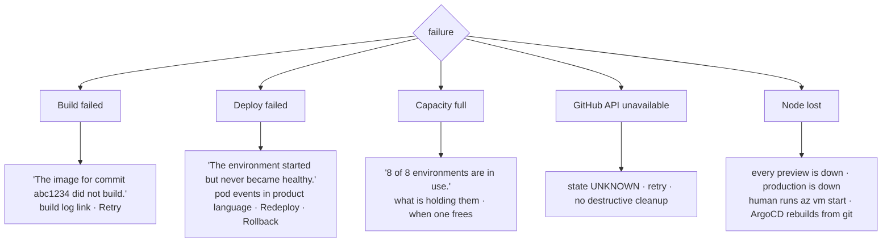
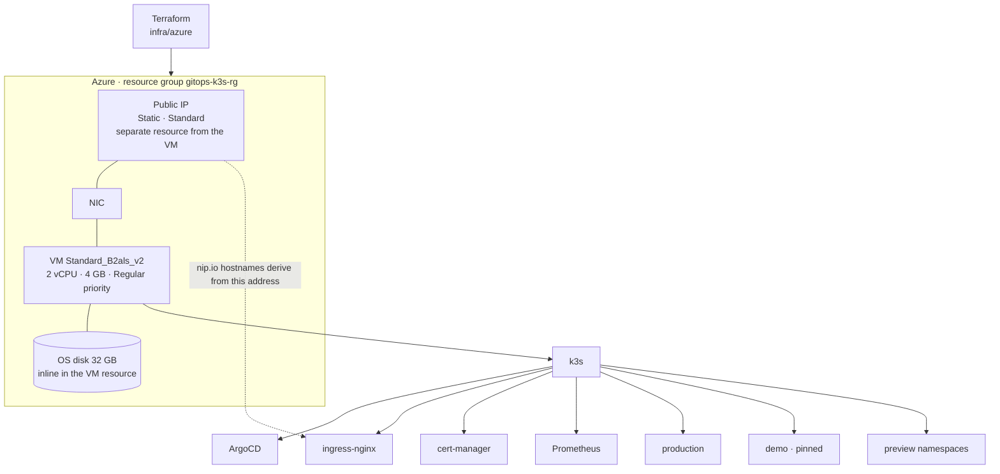
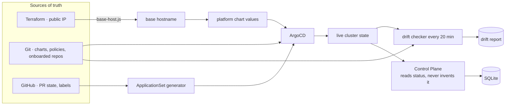
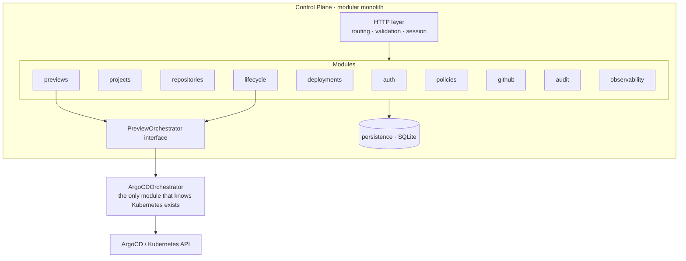

# StackPreview — architecture

The product is a layer above an execution engine that already works. The
engine — ArgoCD, an ApplicationSet PR generator, a Helm chart, namespaces with
quotas and NetworkPolicies — is not rebuilt. The control plane orchestrates it.

The one rule that keeps this honest: **the control plane must not become a
kubectl wrapper.** It speaks in previews, deployments, policies and projects.
The fact that a preview is a namespace and a deployment is an ArgoCD Application
is an implementation detail that stops at the orchestrator boundary.

---

## 1. System architecture



Everything inside `engine` runs in production today. Everything inside
`product` does not exist yet. `control` exists in pieces: the lifecycle engine
is `scripts/lifecycle.js` running in GitHub Actions, and the policy engine is a
handful of values in `deploy/platform/onboarded/*.yaml`.

## 2. Pull request lifecycle



`REJECTED` is a first-class state, not an error. A refused preview has a reason
— capacity full, repository not onboarded, fork without approval — and the
reason belongs in the pull request.

## 3. Provisioning sequence



The image tag is the pull request's **head** SHA, never the merge commit.
GitHub checks out a synthetic merge commit for `pull_request` builds; ArgoCD
deploys the head. Tagging the wrong one produces an environment stuck pulling an
image that was never published, which is the single most common failure this
platform has had.

## 4. Cleanup sequence



Removing a label is the entire deletion API. Nothing in the product deletes a
namespace directly — desired state changes and ArgoCD prunes, so the reaper and
the controller cannot take turns undoing each other (ADR 0002).

## 5. Webhook flow



Signature verification is not optional and the endpoint has no other
authentication. Deliveries are idempotent by `X-GitHub-Delivery`: GitHub retries,
and a retried delivery must not create a second preview.

## 6. Authentication flow



GitHub is the identity provider because every user of this product already has
a GitHub account and the product already needs GitHub permissions. No password
is ever stored. Frontend permission checks are for hiding buttons; the backend
authorizes every request regardless.

## 7. Failure and recovery



The rule for failure UX: the primary message is about the developer's change.
`ImagePullBackOff` is a detail shown lower down, not the headline.

## 8. Infrastructure topology



The public IP and the NIC are separate resources from the VM, so replacing the
VM keeps every URL. The OS disk is inline in the VM resource, so replacing the
VM destroys k3s, ArgoCD and every environment — all of which are rebuilt from
git by the bootstrap. This is documented in `docs/runbook.md` and was verified
against Azure rather than assumed.

## 9. Data flow



There is exactly one source of truth per fact. The node address belongs to
Terraform. Chart and policy belong to git. Pull request state belongs to
GitHub. The control-plane database holds product state — projects, users,
previews, audit — and **never becomes a second opinion about the cluster**: it
records what it observed and when, and reads live status from the orchestrator.

## 10. Control-plane architecture



A modular monolith, not microservices. One process, one database file, module
boundaries enforced by imports rather than by network calls. Splitting this into
services would multiply the operational surface on a node that already runs at
74% memory, and would buy nothing at the scale this targets.

`PreviewOrchestrator` is the seam:

```
create(preview)    →  label the PR; the ApplicationSet does the rest
update(preview)    →  nothing; a new commit is a new image tag
destroy(preview)   →  remove the label; ArgoCD prunes
rollback(preview)  →  point the Application at the previous known-good tag
status(preview)    →  read the Application and its workloads
logs(preview)      →  stream from the workload
```

Only `ArgoCDOrchestrator` imports a Kubernetes client. If a second
implementation is ever needed, nothing above this line changes — and more
importantly, the product cannot accidentally grow a `kubectl apply` endpoint.
